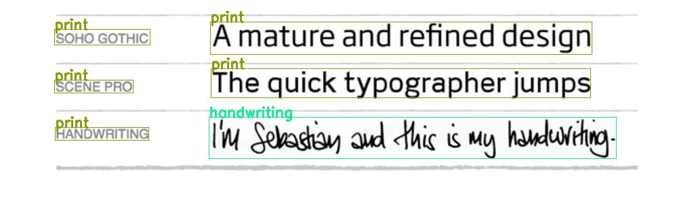

# Text detection and classification based on PaddleOCR's DB algorithm

### Purpose  
If the DBnet text detection network can add multiple classifications, the model can be small and can distinguish categories. If deployed on the Edge devices, it can achieve very high accuracy and efficiency.    

This repo is based on the DB algorithm source code of PaddleOCR-2.7. After modifying the network structure, loss function, data processing and config, it can realize the detection and classification of text.
DB++ algorithm is also supported.

### Installation
```code
conda create -n DBocr python=3.8   
conda activate DBocr   
pip install --upgrade pip 
pip install paddlepaddle-gpu=2.5.0.post117
git clone https://github.com/TachibanaYoshino/PaddleOCR-2.7-Text_Detection_with_Categories.git 
cd  PaddleOCR-2.7-Text_Detection_with_Categories
pip install -r requirements.txt 
```

### Dataset processing
- Please check to the **enjp** dataset in the datasets folder as a reference.
- Use labelme tool to annotate four-point polygons.
- Use dataTools.py to convert the labelme format to paddleocr format.
- Pay special attention to the need to build the **label_list.txt** file for the dataset.  

### Usage
1. Modify the dataset, training, and evaluation configurations according to the 5 configuration files in the configs directory.  
2. Train, see train.sh
3. Eval, see eval.sh
4. Test, see test.sh, Using dynamic models for inference
5. Export, see export.sh, Convert the trained dynamic model into a static model for inference
6. Inference, see predict.sh, Using static models for inference
7. For more tutorials on using text detection, please refer to the [official instructions](https://github.com/PaddlePaddle/PaddleOCR/blob/main/doc/doc_en/detection_en.md).

### Inference demo
- Multilingual text detection and classification
<div align="center">
    
</div>   

- Printed and handwritten text detection and classification
<div align="center">
    
</div>

### Acknowledgment
This code is based on the [PaddleOCR](https://github.com/yangy996/PaddleOCR). Thanks to the contributors of this project.
